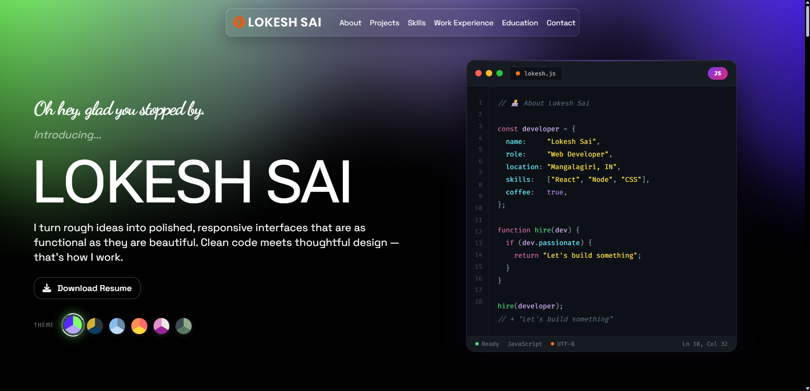

# 🧑‍💻 Lokesh Sai — Portfolio

A personal portfolio website built with **React**, **Vite**, and **Tailwind CSS**. Showcases my skills, projects, work experience, education, and contact info — fully responsive across desktop and mobile.

<!-- INSERT: New portfolio screenshot here -->
> 

---

## 🔗 Live Demo

🌐 [portfolio-lokeshsai.vercel.app](https://portfolio-lokeshsai.vercel.app/)

---

## 🆕 What's New (Latest Update)

This update brings a major visual and UX overhaul to the Hero section and overall design polish.

### ✍️ Typing Greeting Animation
The Hero greeting uses a **character-by-character typing animation** in Dancing Script cursive — giving the intro a handwritten, personal feel.

<!-- INSERT: GIF/screenshot of typing animation -->

### 🎨 Theme Switcher
Added a live **theme switcher** in the Hero section with multiple color presets — users can switch between visual themes on the fly.

<!-- INSERT: Screenshot of theme switcher options -->

### 💻 Code Editor Panel
Added an animated **mock code editor** on the right side of the Hero section (visible on desktop), showing a `lokesh.js` file with a fun developer profile object.

<!-- INSERT: Screenshot of code editor panel -->

### 📐 Hero Layout Improvements
- Left/right split layout on desktop (`md:w-1/2` each side)
- Smooth **Framer Motion** entrance animations (fade + slide for left, scale for right)
- `VariableProximity` name effect — font weight shifts based on cursor distance
- Resume download button with animated ✅ confirmation state
- Button visibility tied to scroll position (hides when hero leaves viewport)

---

## 🎬 Demo

**Old Version**
> https://github.com/user-attachments/assets/49373065-0957-4c00-9792-dc661405d4d0

**New Version**
<!-- INSERT: Upload new demo video to GitHub and paste the link here -->
> https://github.com/user-attachments/assets/22f4eac1-573b-4e43-b2e2-ea2eb378a252

---

## ✨ Features

- **Navbar** — About · Projects · Skills · Work Experience · Education · Contact
- **Hero** — Signature greeting, variable proximity name, code editor panel, theme switcher
- **Projects** — Cards with live links and GitHub repo links
- **Skills, Experience, Education** — Clean sectioned layout
- **Footer** — Social media links
- **Fully Responsive** — Mobile and desktop optimized

---

## 🛠 Tech Stack

| Layer | Tools |
|-------|-------|
| Frontend | React, Vite, JavaScript |
| Styling | Tailwind CSS, Framer Motion |
| Font | Dancing Script (Google Fonts) |
| Deployment | Vercel |

---

## 🚀 Run Locally

```bash
# 1. Clone the repo
git clone https://github.com/lokeshsaidamarla/Portfolio.git

# 2. Navigate into the folder
cd Portfolio

# 3. Install dependencies
npm install

# 4. Start dev server
npm run dev
```

---

## 📁 Project Structure

```
Portfolio/
├── src/
│   ├── components/
│   │   ├── reactbit/
│   │   │   ├── TypingGreet.jsx      # Typing cursor animation
│   │   │   ├── CodeEditor.jsx       # ✨ New — mock code editor
│   │   │   ├── ThemeSwitcher.jsx    # ✨ New — theme switcher
│   │   │   └── VariableProximity.jsx
│   │   └── ...
│   ├── sections/
│   │   ├── Hero.jsx
│   │   └── ...
│   ├── constants/
│   └── assets/
├── public/
└── ...
```

---

## 📬 Contact

Made with ☕ by **Lokesh Sai**  
[GitHub](https://github.com/lokeshsaidamarla) · [Portfolio](https://portfolio-lokeshsai.vercel.app/)
